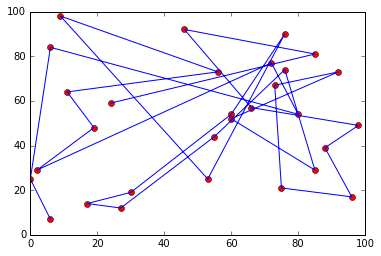

# genetic_alg_opt
##An example of a genetic algorithm running on a traveling salesman problem
This 30 city traveling salesmen genetic algorithm runs over 500 generations, using generations of 100 individuals. The cities are randomly generated at every run. Roulette wheel selection and modified crossover are utilized to provide the selection and reproduction stages. The following gif is made of a plot made every 10 generations showing the progress of the algorithm:

